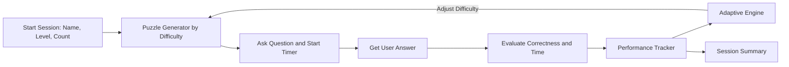

# Math Adventures — AI-Powered Adaptive Learning Prototype

An explainable, **console-based adaptive learning system** that helps children (ages 5–10) practice basic math.  
The prototype generates puzzles, tracks performance, and **automatically adjusts difficulty** to keep learners in their optimal challenge zone.

This project demonstrates how AI-style personalization can be implemented with a lightweight, rule-based adaptive engine.

---

## ✨ Features

- **Three difficulty levels**: Easy, Medium, Hard  
- **Dynamic puzzle generation** for addition, subtraction, multiplication, and division  
- **Performance tracking**: correctness + response time  
- **Adaptive difficulty engine** (reinforcement-style rule-based model)  
- **End-of-session summary** (accuracy, timing, transitions, recommended level)  
- **CSV logs** for every session (useful for ML training later)  

---

## 🗂️ Repository Structure

```
math-adaptive-prototype/
├─ README.md
├─ requirements.txt
├─ src/
│  ├─ main.py
│  ├─ puzzle_generator.py
│  ├─ tracker.py
│  └─ adaptive_engine.py
└─ logs/
```

---

## 🚀 Getting Started

### Run the app (recommended):
```bash
cd math-adaptive-prototype
python -m src.main
```

### Alternatively:
```bash
python src/main.py
```

Press **q** anytime to quit.

---

## 🧠 Technical Overview

### Architecture



---

## 🧩 Core Components

### 1. Puzzle Generator (`puzzle_generator.py`)
Generates math problems for Easy/Medium/Hard levels with child-friendly constraints.

### 2. Performance Tracker (`tracker.py`)
Logs correctness, timing, transitions, and produces summary metrics.

### 3. Adaptive Engine (`adaptive_engine.py`)
Uses a momentum-based rule:

- Correct = +1  
- Incorrect = −1  
- Fast = +0.5  
- Slow = −0.5  

Momentum smooths noise and triggers level up/down automatically.

---

## 📊 Example Console Summary

```
==== Session Summary ====
Player: Teja
Questions answered: 20
Accuracy: 85.0%
Average time/question: 6.7s
Difficulty transitions: Easy -> Medium (Q8), Medium -> Hard (Q15)
Next recommended level: Medium
```

---

## 📈 What This Prototype Demonstrates

- AI-style personalized difficulty adjustment  
- Real-time performance tracking  
- Lightweight adaptive logic  
- Data logging for future ML modeling  

---

## 🔬 ML Upgrade Path

To convert the adaptive engine into an ML-driven one:

1. Collect logs → derive features  
2. Train logistic regression / decision tree  
3. Predict level-up / level-down probabilities  
4. Replace rule-based logic with learned policy  

---

## 🧪 Logging

Each session generates a CSV file in `/logs`.

---

## 🖥️ System Requirements

- Python 3.9+  
- No external libraries required  

Optional:
```
streamlit     # UI
rich          # pretty console output
```

---

## ✔️ Evaluation Checklist

- [x] Three difficulty levels  
- [x] Adaptive difficulty engine  
- [x] Performance tracking  
- [x] Modular code  
- [x] Summary + CSV logs  
- [x] Technical note included  

---

## 📦 License
MIT
